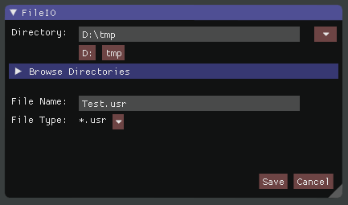
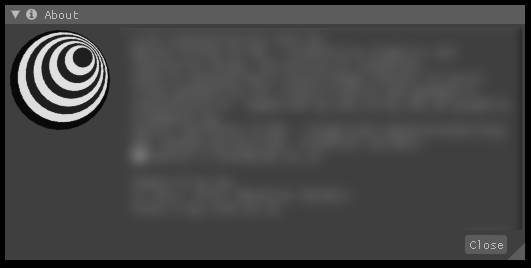

# Imgui-IGS-Snippets
Imgui code exchanges for convenience at IGS 

## Tested on
 * windows, mingw gcc 5.1.0 - cmake/ninja, imgui 1.49
 * ubuntu, gcc 5.4 - cmake/ninja, imgui 1.50

## FileIO Dialogue
 * similar to the standard windows file-io
 * additional recent file drop down
 * additional subdirectory buttons (linux style)

 
 
  * snippet example - save:
  ```c++
if( window_fileIO_visible )
{
    string save_file;
    if( fileIOWindow( save_file, window_recent_files, "Save", {"*.usr", "*.*"} ) )
    {
        window_fileIO_visible = false;
        if( !save_file.empty() )
        {
            window_recent_files.push_back( save_file );
 
            ofstream out_file;
            out_file.open( save_file, ios_base::trunc );          
            writeStuffToFile( out_file ); 
            out_file.close();
        }
    }
}  
  ```
  * snippet example - open:
  ```c++
if( window_fileIO_visible )
{
    string open_file;
    if( fileIOWindow( open_file, window_recent_files, "Open", {"*.usr", "*.*"}, true  ) )
    {
        window_fileIO_visible = false;
        if( !open_file.empty() )
        {
            window_recent_files.push_back( open_file );
            readStuffFromFile( open_file );
        }
    }
}	
  ```
  

## About Dialoge
 * text
 * close button
 * animated IGS logo
 
 
 
 * snippet example:
  ```c++
if( about_window_visible &&  
      aboutWindow( 
		ICON_FA_INFO_CIRCLE " About",
		"My fancy tools\n"
		"Abla bli blub ....\n",
		ImVec2( 400, 155 ),
		time ) )
		about_window_visible = false;
  ```


## Frameclock Statistic Dialogue
 * Overall Time
 * Framecounter
 * Frames per Second (current, min, avg, max)
 * Frametime (current, min, avg, max)
 * Frames per Second Plot over time
 * Frametime histogram

 

 * snippet example:
  ```c++
static FrameClock clock;

clock.beginFrame();

frameClockWindow(clock);

clock.endFrame();
  ```